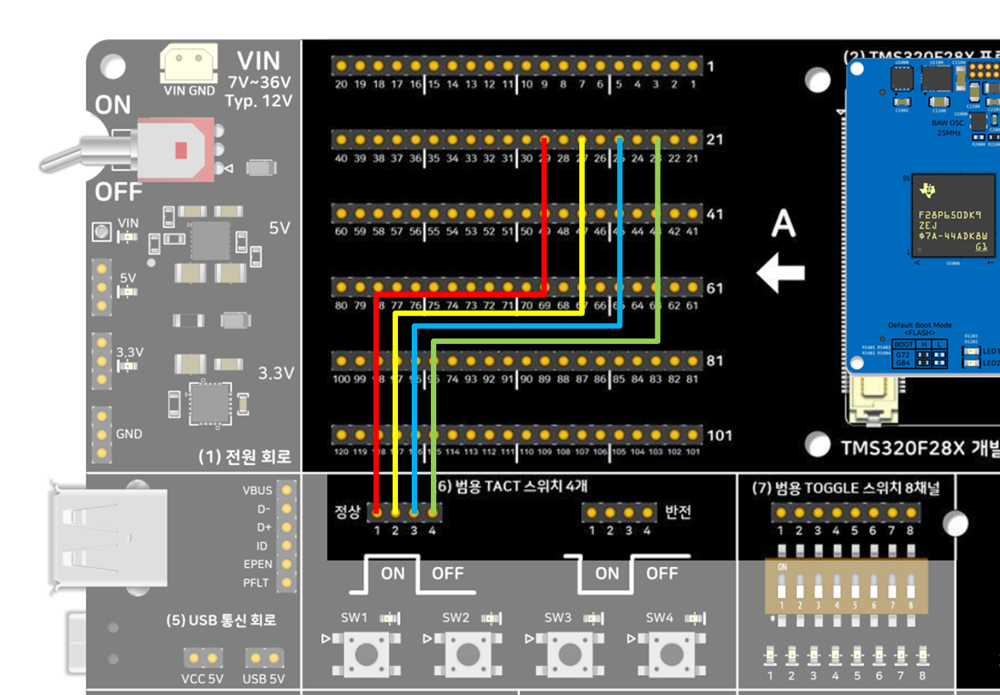

# 택트 스위치 4개 테스트 — DriverLib 버전 — TMS320F28P659DK8-Q1

개발보드 V2 [`07-3개월-일일예제-캘린더.md`](../../../../dev_board_v2/07-3개월-일일예제-캘린더.md)
1주차 수요일 항목. 회로블록 **(6) 범용 Tactile 스위치 4개**를 순수 DriverLib(SysConfig
미사용)로 읽습니다.

`tact4_test`라는 이름으로 있던 기존 예제를 [6_GP_Tactile4_Bitfield](../6_GP_Tactile4_Bitfield/README.md),
[6_GP_Tactile4_Freertos](../6_GP_Tactile4_Freertos/README.md)와 짝을 맞추기 위해 `6_GP_Tactile4_Driverlib`로
옮기고 이름만 바꿨습니다 — 동작 코드는 그대로입니다.

## 요구 하드웨어
- SyncWorks TMS320F28X 개발보드 V2
- TMS320F28P650DK9 또는 TMS320F28P659DK8-Q1 모듈
- 점퍼 케이블 4개

## 배선
개발보드 **A Side 핀-헤더 23, 25, 27, 29번**(홀수, 4핀, GPIO67~GPIO70에 1:1 대응)을 (6)
범용 Tactile 스위치 4개 블록의 입력 4핀에 연결하세요. 핀 매핑 근거:
[`SYNCWORKS_DEVBOARDV2_F28P65X.syscfg.json`](../../../../dev_board_v2/10-sysconfig-보드파일/SYNCWORKS_DEVBOARDV2_F28P65X.syscfg.json)

**v1.10부터 스위치 번호와 GPIO 대응이 핀 순서와 반대입니다** — 4핀을 순서대로 1,2,3,4번에
연결하면 점퍼선이 서로 엇갈려 꼬이기 때문에, 반대로 배정해서 1번 스위치 점퍼선이 가장
먼 핀(29번)에서 시작해 안쪽으로 나란히 들어오도록 했습니다:

| 스위치 | GPIO | A Side 핀 |
|---|---|---|
| 1번 | GPIO70 | 29번 |
| 2번 | GPIO69 | 27번 |
| 3번 | GPIO68 | 25번 |
| 4번 | GPIO67 | 23번 |



위 배선도의 "정상(비반전)" 행 SW1~4가 왼쪽부터 순서대로 핀 29/27/25/23번에 연결되는
것을 보면, 점퍼선이 서로 교차하지 않고 나란히 들어가는 걸 확인할 수 있습니다 — 이게
스위치 번호를 핀 순서와 반대로 배정한 이유입니다.

## 소프트웨어 버전
CCS 21.x / **SysConfig 미사용** / C2000Ware 26.00.00.00 driverlib(로컬 복사) / CGT 22.6.3.LTS.
`device.h`/`device.c`/`driverlib.h`/driverlib 헤더 전체/`driverlib.lib`를 전부 프로젝트
폴더 안에 복사해 두었으므로, C2000Ware 설치 경로와 무관하게 빌드됩니다.

## 동작 원리

### 1. GPIO를 입력으로 설정하기
`GPIO_setDirectionMode(gpio, GPIO_DIR_MODE_IN)`은 그 GPIO 핀의 방향 레지스터에서
해당 비트를 "입력"으로 클리어합니다 — 입력 방향이면 CPU는 핀 전압을 읽기만 하고
자기가 전압을 실어보내지 않습니다(하이 임피던스). `GPIO_setPadConfig(gpio,
GPIO_PIN_TYPE_PULLUP)`으로 내부 풀업까지 켜서, 혹시 점퍼선이 빠지거나 스위치
회로가 연결 안 된 상태에서도 핀이 "붕 뜬(Floating)" 채로 남지 않고 3.3V 쪽으로
당겨지도록 안전장치를 둡니다 — 붕 뜬 입력 핀은 주변 노이즈로 랜덤하게 0/1이
튀는 오작동의 흔한 원인입니다.

### 2. Active High와 "카운트"의 의미
개발보드의 (6) Tactile 스위치 회로는 스위치를 누르면 그 핀에 3.3V(로직 1)가,
안 누르면 0V(로직 0)가 걸리도록 설계돼 있습니다 — 이게 **Active High**입니다
(반대는 Active Low). `GPIO_readPin(gpio)`이 1을 반환하면 "지금 눌려 있다"는
뜻입니다.

다만 `state`(지금 이 순간 눌려 있는지)와 `pressCount`(몇 번 눌렀는지)는 다른
개념입니다. 매 폴링 주기(10msec)마다 그냥 "지금 1이다"라고 카운트를 올리면,
스위치를 1초 누르고 있는 동안 100번 카운트가 올라가 버립니다. 그래서 "방금 막
0에서 1로 바뀐 순간"만 잡아내는 **에지 검출(Edge Detection)**을 씁니다:

```c
risingEdges = (uint16_t)(state & (uint16_t)(~prevState));
```

이렇게 하면 스위치를 누르고 있는 동안 계속 1이어도 `pressCount`는 "누르는 순간"
딱 한 번만 올라갑니다.

### 3. 왜 한 번 눌렀는데 여러 번 카운트될 수 있는가 — 스위치 바운스(Bounce)
에지 검출을 쓰는데도 `pressCount`가 한 번의 물리적 클릭에 2~5번씩 잡히는 걸
보실 수 있습니다. 코드 버그가 아니라 **기계식 스위치의 물리적 특성** 때문입니다
— 스위치 내부 금속 접점이 닫히는 순간 완벽하게 한 번에 붙는 게 아니라, 수 msec
동안 미세하게 튕기면서(Bounce) 붙었다 떨어졌다를 여러 번 반복합니다. 이 예제는
10msec마다 폴링하는데, 바운스가 보통 1~10msec 정도 지속되기 때문에 그 튕기는
구간에서 0→1→0→1이 여러 번 잡혀 `pressCount`가 과다 계수됩니다.

실제 제품에서 쓰는 대표적인 디바운스(Debounce) 방법:
- **시간 기반**: 에지를 한 번 잡으면, 그 뒤 일정 시간(예: 20~50msec) 동안은 같은
  핀의 변화를 무시합니다 — 바운스가 끝날 시간을 벌어주는 방식.
- **연속 샘플 확인**: 값이 바뀐 걸 감지해도 바로 확정하지 않고, N번 연속(예: 3~5회)
  같은 값이 나올 때만 "진짜 바뀌었다"고 인정합니다.
- **하드웨어 디바운스**: 스위치 회로 자체에 RC 필터+슈미트 트리거를 넣어 바운스를
  전기적으로 걸러내는 방법(가장 깔끔하지만 회로 수정이 필요).

이 예제는 일부러 디바운스를 빼서 "에지 검출만 있을 때 실제로 어떤 문제가 생기는지"를
직접 관찰할 수 있게 했습니다 — 정식 디바운스 구현은 이후 예제에서 다룰 예정입니다.

## Import → Build → Flash → Run
1. CCS에서 `CCS/6_GP_Tactile4_Driverlib.projectspec`를 Import — 압축을 미리 풀어서
   "Select search-directory"로 폴더를 지정하거나, zip 파일을 그대로 "Select archive
   file"로 지정해도 됩니다(둘 다 정상 동작 — 아래 참고).
2. Build (CPU1_RAM 또는 CPU1_FLASH)
3. Debug 연결 후 Flash/Run
4. `.ccxml`은 `TMS320F28P650DK9.ccxml`을 그대로 사용 — F28P659DK8-Q1 최초 연결 시 정상
   인식 확인 필요

> **고친 zip-import 버그**: 예전엔 `driverlib.lib`를 `.projectspec`에
> `action="link"`로 지정해서, GitHub에서 zip을 받아 CCS "Select archive file"로 바로
> import하면 `driverlib.lib`가 **unresolved**로 뜨는 문제가 있었습니다 — CCS가 zip을
> 임시 폴더(`...\AppData\Local\Temp\ccs-import-XXXXXX\`)에 풀고 나서 그 임시 경로를
> 가리키는 링크를 만드는데, 임시 폴더가 정리되면 링크가 끊어지기 때문입니다(압축을
> 미리 풀어서 폴더로 import하면 그 폴더가 안 지워지니 문제가 없었습니다). `device/`
> 폴더처럼 `action="copy"`로 바꿔서 완전히 해결했습니다.

## 정상 동작 확인
- 4개 택트 스위치를 누를 때마다 스위치 옆 LED Indicator가 즉시 반응하면 배선이 맞는
  것입니다.
- CCS Expressions 창에 `tactSwitchState`(비트0=1번 스위치=GPIO70 ~ 비트3=4번 스위치=GPIO67), `pressCount`(스위치가
  새로 눌릴 때마다 누적)를 추가하고 Continuous Refresh를 켜서 확인하세요. 디바운스 처리는
  하지 않아 `pressCount`가 한 번의 물리적 클릭에 여러 번 잡힐 수 있습니다 — 이는 의도된
  단순화이며, 정식 디바운스는 별도 예제(이후 주차)에서 다룰 예정입니다.

## 세 가지 버전 비교
| 버전 | 폴더 | 핵심 차이 |
|---|---|---|
| **DriverLib(이 폴더)** | 6_GP_Tactile4_Driverlib | TI 표준 HAL 함수 호출 |
| 비트필드 | [6_GP_Tactile4_Bitfield](../6_GP_Tactile4_Bitfield/) | 레지스터 구조체 직접 조작, DriverLib 미사용 |
| FreeRTOS | [6_GP_Tactile4_Freertos](../6_GP_Tactile4_Freertos/) | DriverLib + 태스크 스케줄링, 정적 할당 |

### 메모리 실측 비교 (2026-09-16, CCS 21.x, CPU1_RAM 빌드, `.map` 기준)

세 프로젝트 모두 `workspace_ccstheia`에서 실제로 Import → Build까지 성공한 뒤의 `.map`
파일 MODULE SUMMARY "Grand Total"(code/ro data/rw data) 기준 실측치입니다.

| 버전 | code | ro data | rw data | 합계 |
|---|---:|---:|---:|---:|
| **DriverLib(이 폴더)** | 2,968 B | 603 B | 1,030 B (스택 1,016B) | **4,601 B** |
| 비트필드 | 3,801 B | 478 B | 1,685 B (스택 256B) | **5,964 B** |
| FreeRTOS | 5,084 B | 820 B | 1,239 B (RTS 스택 512B + 태스크 정적 스택 512B + 전역변수 215B) | **7,143 B** |

비트필드 버전의 rw data가 유독 큰 건 클래식 `f28p65x_globalvariabledefs.c`가 주변장치
레지스터 구조체 전체를 항상 전역 심볼로 선언해서(실제 추가 RAM 소비 없이 기존 레지스터
주소를 덮어씌운 것) 링커가 "rw data"로 잡기 때문입니다 — DriverLib은 이런 이름 붙은
전역 구조체 없이 주소 매크로만 써서 이 항목이 없습니다.

## 관련 링크
- 상품 페이지: https://tms320f28x.co.kr/goods/goods_view.php?goodsNo=200903127
- 게시판 글: (게시 후 URL 추가 예정)
- 유튜브 영상: (게시 후 URL 추가 예정)
